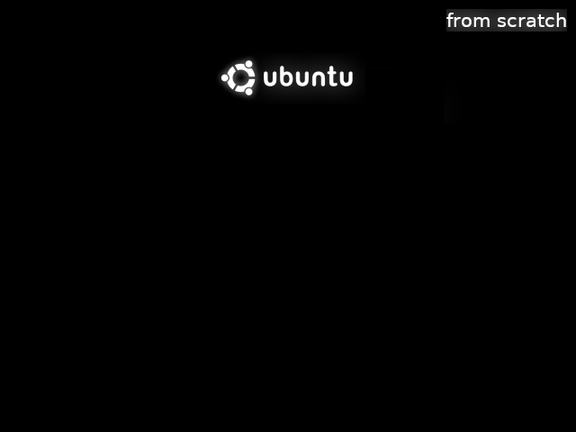

# Live custom Ubuntu from scratch

## Prerequisites (GNU/Linux Debian/Ubuntu)

Install applications we need to build the environment.

```
sudo apt-get install \
    debootstrap \
    squashfs-tools \
    genisoimage \
    syslinux \
    isolinux
```

```
mkdir $HOME/live-ubuntu-from-scratch
```

## Bootstrap and Configure Ubuntu
```
sudo debootstrap \
    --arch=amd64 \
    --variant=minbase \
    bionic \
    $HOME/live-ubuntu-from-scratch/chroot \
    http://us.archive.ubuntu.com/ubuntu/
```

```
sudo mount --bind /dev $HOME/live-ubuntu-from-scratch/chroot/dev

sudo mount --bind /run $HOME/live-ubuntu-from-scratch/chroot/run
```

## Access chroot environment
```
sudo chroot $HOME/live-ubuntu-from-scratch/chroot
```

1. **Configure mount points**
   ```
   mount none -t proc /proc

   mount none -t sysfs /sys

   mount none -t devpts /dev/pts

   export HOME=/root

   export LC_ALL=C
   ```

2. **Set a custom hostname**
   ```
   echo "ubuntu-live" > /etc/hostname
   ```

3. **Configure apt sources.list**
   ```
   cat <<EOF > /etc/apt/sources.list
   deb http://us.archive.ubuntu.com/ubuntu/ bionic main restricted universe multiverse 
   deb-src http://us.archive.ubuntu.com/ubuntu/ bionic main restricted universe multiverse 

   deb http://us.archive.ubuntu.com/ubuntu/ bionic-security main restricted universe multiverse 
   deb-src http://us.archive.ubuntu.com/ubuntu/ bionic-security main restricted universe multiverse 

   deb http://us.archive.ubuntu.com/ubuntu/ bionic-updates main restricted universe multiverse 
   deb-src http://us.archive.ubuntu.com/ubuntu/ bionic-updates main restricted universe multiverse    
   EOF
   ```

4. **Update indexes packages**
   ```
   apt-get update
   ```

5. **Install systemd**
   ```
   apt-get install -y systemd-sysv
   ```

5. **Configure machine-id and divert**
   ```
   dbus-uuidgen > /var/lib/dbus/machine-id

   dpkg-divert --local --rename --add /sbin/initctl
   
   ln -s /bin/true /sbin/initctl
   ```

6. **Install packages needed for Live System**
   ```
   apt-get install -y \
       ubuntu-standard \
       casper \
       lupin-casper \
       discover \
       laptop-detect \
       os-prober \
       network-manager \
       net-tools \
       wireless-tools \
       wpagui \
       locales \
       linux-generic
   ```
  
7. **Graphical installer**
   ```
   apt-get install -y \
       ubiquity \
       ubiquity-casper \
       ubiquity-frontend-gtk \
       ubiquity-slideshow-ubuntu \
       ubiquity-ubuntu-artwork
   ```

8. **Install window manager**
   ```
   apt-get install -y \
       plymouth-theme-ubuntu-logo \
       ubuntu-gnome-desktop \
       ubuntu-gnome-wallpapers
   ```

9. **Install usefull applications**
   ```
   apt-get install -y \
       clamav-daemon \
       terminator \
       apt-transport-https \
       curl \
       vim \
       nano
   ```

10. **Install Visual Studio Code**

    1. Download and install the key 
       ```
       curl https://packages.microsoft.com/keys/microsoft.asc | gpg --dearmor > microsoft.gpg

       install -o root -g root -m 644 microsoft.gpg /etc/apt/trusted.gpg.d/
       
       echo "deb [arch=amd64] https://packages.microsoft.com/repos/vscode stable main" > /etc/apt/sources.list.d/vscode.list

       rm microsoft.gpg
       ```

    2. Then update the package cache and install the package using:
       ```
       apt-get update
       
       apt-get install -y code
       ```

11. **Install Google Chrome**

    1. Download and install the key 
       ```
       wget -q -O - https://dl-ssl.google.com/linux/linux_signing_key.pub | sudo apt-key add -
       ```

    2. Add the key to the repository
       ```
       echo "deb http://dl.google.com/linux/chrome/deb/ stable main" > /etc/apt/sources.list.d/google-chrome.list
       ```

    3. Finally, Update repository and install Google Chrome.
       ```
       apt-get update

       apt-get install google-chrome-stable
       ```

12. **Install Java JDK 8**
    ```
    apt-get install -y \
        openjdk-8-jdk \
        openjdk-8-jre
    ```

13. **Remove unused applications**
    ```
    apt-get purge -y \
        transmission-gtk \
        transmission-common \
        gnome-mahjongg \
        gnome-mines \
        gnome-sudoku \
        aisleriot \
        hitori
    ```

14. **Remove unused packages**
    ```
    apt-get autoremove -y
    ```

15. **Reconfigure packages**

    1. **Generate locales**
       ```
       dpkg-reconfigure locales
       ```

    2. **Reconfigure resolvconf**
       ```
       dpkg-reconfigure locales
       ```

    3. **Configure network-manager**
       ```
       cat <<EOF > /etc/NetworkManager/NetworkManager.conf
       [main]
       rc-manager=resolvconf
       plugins=ifupdown,keyfile
       dns=dnsmasq
       
       [ifupdown]
       managed=false
       EOF
       ```

    4. **Reconfigure network-manager**
       ```
       dpkg-reconfigure network-manager
       ```

15. **Cleanup the chroot environment**

    1. If you installed software, be sure to run
       ```
       rm /var/lib/dbus/machine-id
       ```

    2. Remove the diversion
       ```
       rm /sbin/initctl

       dpkg-divert --rename --remove /sbin/initctl
       ```

    3. Clean up
       ```
       apt-get clean

       rm -rf /tmp/* ~/.bash_history

       umount /proc
       
       umount /sys
       
       umount /dev/pts

       export HISTSIZE=0
       
       exit
       ```

## Unbind mount points
```
sudo umount $HOME/live-ubuntu-from-scratch/chroot/dev

sudo umount $HOME/live-ubuntu-from-scratch/chroot/run
```

## Create the CD image directory and populate it

1. Access build directory
   ```
   cd $HOME/live-ubuntu-from-scratch
   ```

2. Create directories
   ```
   mkdir -p image/{casper,isolinux,install}
   ```

2. Copy kernel images
   ```
   sudo cp chroot/boot/vmlinuz-**-**-generic image/casper/vmlinuz

   sudo cp chroot/boot/initrd.img-**-**-generic image/casper/initrd
   ```

3. Copy isolinux and memtest binaries
   ```
   sudo cp /usr/lib/ISOLINUX/isolinux.bin image/isolinux/

   sudo cp /usr/lib/syslinux/modules/bios/{chain,gfxboot,ldlinux,libutil,libcom32,vesamenu}.c32 image/isolinux/

   sudo cp chroot/boot/memtest86+.bin image/install/memtest
   ```

## Boot Instructions

1. **Splash screen**

   1. Access build directory
      ```
      cd $HOME/live-ubuntu-from-scratch
      ```
   
   2. Create image 640x480 in png format (splash.png)
   
      <p align="center">
          <br>
      </p>

   3. Move image
      ```
      sudo mv splash.png image/isolinux/
      ```

2. **Boot-loader configuration**

   1. Access build directory
      ```
      cd $HOME/live-ubuntu-from-scratch
      ```
   
   2. Create image/isolinux/isolinux.cfg
      ```
      cat <<EOF > image/isolinux/isolinux.cfg
      path 
      include menu.cfg
      default vesamenu.c32
      prompt 0
      timeout 50
      EOF
      ```
   
   3. Create image/isolinux/menu.cfg
      ```
      cat <<EOF > image/isolinux/menu.cfg
      menu hshift 13
      menu width 49
      menu margin 8
   
      menu title Installer boot menu
      include stdmenu.cfg
      include txt.cfg
      EOF
      ```
   
   4. Create image/isolinux/stdmenu.cfg
      ```
      cat <<EOF > image/isolinux/stdmenu.cfg
      menu background splash.png
      menu color title	    * #FFFFFFFF *
      menu color border	* #00000000 #00000000 none
      menu color sel		* #ffffffff #76a1d0ff *
      menu color hotsel	1;7;37;40 #ffffffff #76a1d0ff *
      menu color tabmsg	* #ffffffff #00000000 *
      menu color help		37;40 #ffdddd00 #00000000 none
      menu vshift 12
      menu rows 10
      menu helpmsgrow 15
      # The command line must be at least one line from the bottom.
      menu cmdlinerow 16
      menu timeoutrow 16
      menu tabmsgrow 18
      menu tabmsg Press ENTER to boot or TAB to edit a menu entry
      EOF
      ```
   
   5. Create image/isolinux/txt.cfg
      ```
      cat <<EOF > image/isolinux/txt.cfg
      default live
      label live
          menu label ^Try Ubuntu without installing
          kernel /casper/vmlinuz
          append  file=/cdrom/preseed/ubuntu.seed boot=casper initrd=/casper/initrd quiet splash ---
      label live-install
          menu label ^Install Ubuntu
          kernel /casper/vmlinuz
          append  file=/cdrom/preseed/ubuntu.seed boot=casper only-ubiquity initrd=/casper/initrd quiet splash ---
      label check
          menu label ^Check disc for defects
          kernel /casper/vmlinuz
          append  boot=casper integrity-check initrd=/casper/initrd quiet splash ---
      label memtest
          menu label Test ^memory
          kernel /install/memtest
      EOF
      ```
   
## Create manifest

1. Access build directory
   ```
   cd $HOME/live-ubuntu-from-scratch
   ```

2. Generate manifest
   ```
   sudo chroot chroot dpkg-query -W --showformat='${Package} ${Version}\n' | sudo tee image/casper/filesystem.manifest

   sudo cp -v image/casper/filesystem.manifest image/casper/filesystem.manifest-desktop

   sudo sed -i '/ubiquity/d' image/casper/filesystem.manifest-desktop
   
   sudo sed -i '/casper/d' image/casper/filesystem.manifest-desktop
   
   sudo sed -i '/discover/d' image/casper/filesystem.manifest-desktop
   
   sudo sed -i '/laptop-detect/d' image/casper/filesystem.manifest-desktop
   
   sudo sed -i '/os-prober/d' image/casper/filesystem.manifest-desktop
   ```

## Compress the chroot

1. Access build directory
   ```
   cd $HOME/live-ubuntu-from-scratch
   ```

2. Create squashfs
   ```
   sudo mksquashfs chroot image/casper/filesystem.squashfs
   ```

3. Write the filesystem.size
   ```
   printf $(sudo du -sx --block-size=1 chroot | cut -f1) > image/casper/filesystem.size
   ```

## Create diskdefines

1. Access build directory
   ```
   cd $HOME/live-ubuntu-from-scratch
   ```

2. Create file image/README.diskdefines
   ```
   cat <<EOF > image/README.diskdefines
   #define DISKNAME  Ubuntu from scratch
   #define TYPE  binary
   #define TYPEbinary  1
   #define ARCH  amd64
   #define ARCHamd64  1
   #define DISKNUM  1
   #define DISKNUM1  1
   #define TOTALNUM  0
   #define TOTALNUM0  1
   EOF
   ```

## Recognition as an Ubuntu from scratch

1. Access build directory
   ```
   cd $HOME/live-ubuntu-from-scratch
   ```

2. Create an empty file named "ubuntu" and a hidden ".disk" folder. 
   ```
   touch image/ubuntu
   
   mkdir image/.disk
   ```

## Calculate MD5

1. Access build directory
   ```
   cd $HOME/live-ubuntu-from-scratch
   ```

2. Generate md5sum.txt
   ```
   sudo /bin/bash -c "(cd image && find . -type f -print0 | xargs -0 md5sum | grep -v "\./md5sum.txt" > md5sum.txt)"
   ```

## Create ISO Image for a LiveCD

1. Access image directory
   ```
   cd $HOME/live-ubuntu-from-scratch/image
   ```

2. Create iso from the image directory using the command-line
   ```
   sudo genisoimage -D -r \
       -V "Ubuntu from scratch" \
       -cache-inodes -J -l \
       -b isolinux/isolinux.bin \
       -c isolinux/boot.cat \
       -no-emul-boot \
       -boot-load-size 4 \
       -boot-info-table -o ../ubuntu-from-scratch.iso .
   ```
