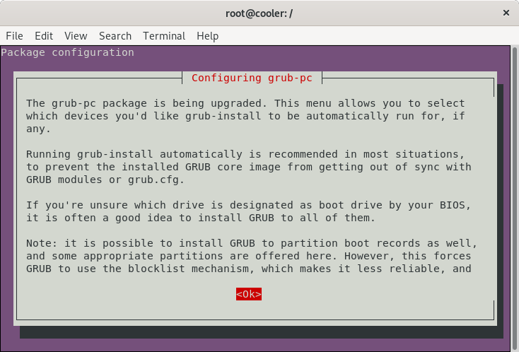
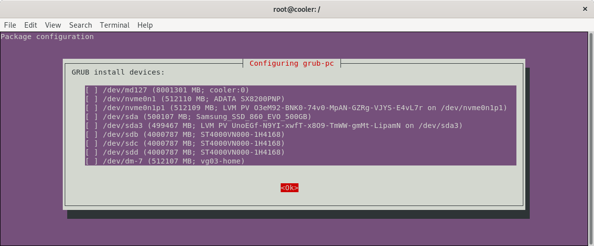
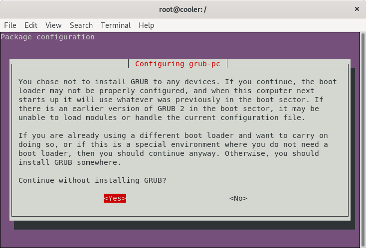
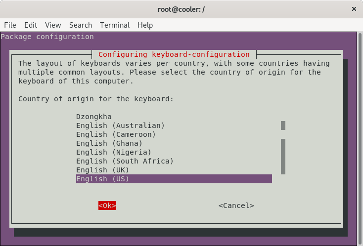
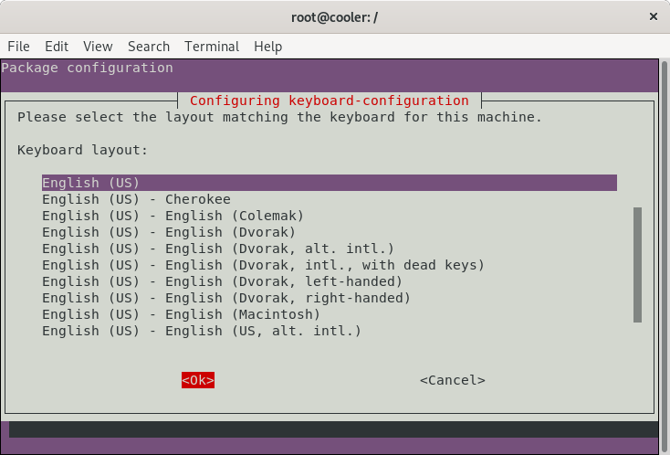
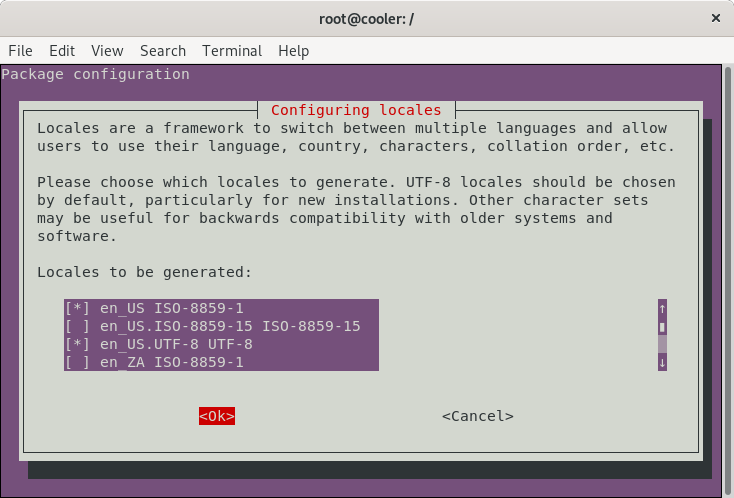
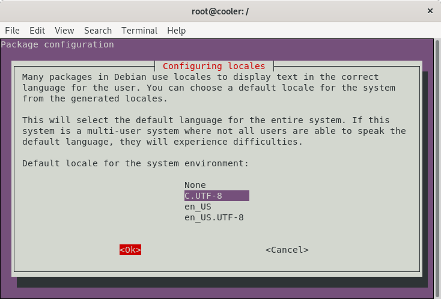
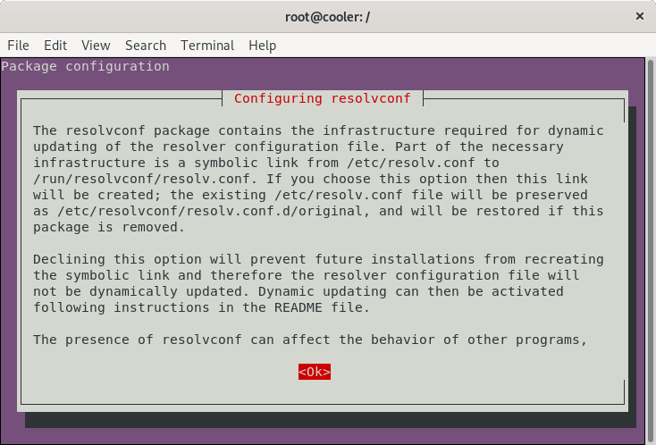
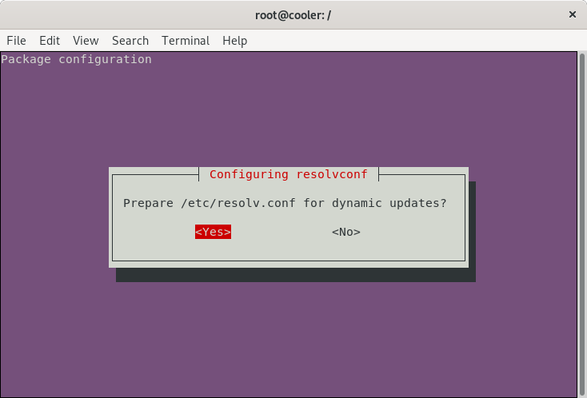
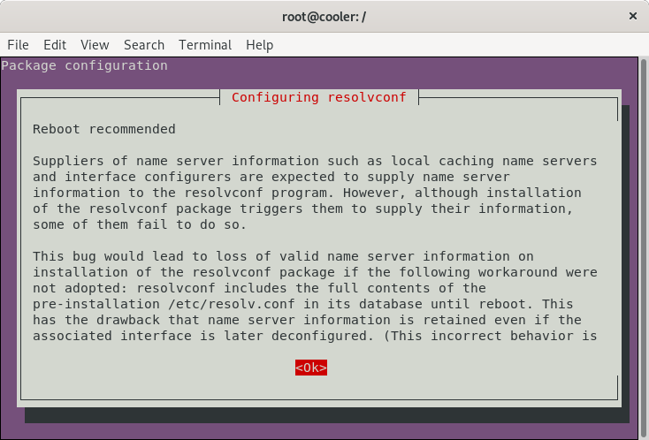

# How to create a custom Ubuntu live from scratch

This procedure works and can create a bootable and installable Ubuntu Live (along with the automatic hardware detection and configuration) from scratch.

## Prerequisites (GNU/Linux Debian/Ubuntu)

Install applications we need to build the environment.

```
sudo apt-get install \
    debootstrap \
    squashfs-tools \
    xorriso \
    grub-pc-bin \
    grub-efi-amd64-bin \
    mtools
```

```
mkdir $HOME/live-ubuntu-from-scratch
```

## Bootstrap and Configure Ubuntu

* Checkout bootstrap
  ```
  sudo debootstrap \
     --arch=amd64 \
     --variant=minbase \
     bionic \
     $HOME/live-ubuntu-from-scratch/chroot \
     http://us.archive.ubuntu.com/ubuntu/
  ```
  > **debootstrap** is used to create a Debian base system from scratch, without requiring the availability of **dpkg** or **apt**. It does this by downloading .deb files from a mirror site, and carefully unpacking them into a directory which can eventually be **chrooted** into.

* Configure external mount points
  ```
  sudo mount --bind /dev $HOME/live-ubuntu-from-scratch/chroot/dev
  
  sudo mount --bind /run $HOME/live-ubuntu-from-scratch/chroot/run
  ```
  As we will be updating and installing packages (among them grub), these mount points are necessary inside the chroot environment, so we can be able to finish the installations without errors.

## Define chroot environment

*A chroot on Unix operating systems is an operation that changes the apparent root directory for the current running process and its children. A program that is run in such a modified environment cannot name (and therefore normally cannot access) files outside the designated directory tree. The term "chroot" may refer to the chroot(2) system call or the chroot(8) wrapper program. The modified environment is called a chroot jail.*

> Reference: https://en.wikipedia.org/wiki/Chroot

1. **Access chroot environment**
  ```
  sudo chroot $HOME/live-ubuntu-from-scratch/chroot
  ```

2. **Configure mount points, home and locale**
   ```
   mount none -t proc /proc

   mount none -t sysfs /sys

   mount none -t devpts /dev/pts

   export HOME=/root

   export LC_ALL=C
   ```

   These mount points are necessary inside the chroot environment, so we can be able to finish the installations without errors.

3. **Set a custom hostname**
   ```
   echo "ubuntu-fs-live" > /etc/hostname
   ```

4. **Configure apt sources.list**
   ```
   cat <<EOF > /etc/apt/sources.list
   deb http://us.archive.ubuntu.com/ubuntu/ bionic main restricted universe multiverse 
   deb-src http://us.archive.ubuntu.com/ubuntu/ bionic main restricted universe multiverse 

   deb http://us.archive.ubuntu.com/ubuntu/ bionic-security main restricted universe multiverse 
   deb-src http://us.archive.ubuntu.com/ubuntu/ bionic-security main restricted universe multiverse 

   deb http://us.archive.ubuntu.com/ubuntu/ bionic-updates main restricted universe multiverse 
   deb-src http://us.archive.ubuntu.com/ubuntu/ bionic-updates main restricted universe multiverse    
   EOF
   ```

4. **Update indexes packages**
   ```
   apt-get update
   ```

5. **Install systemd**
   ```
   apt-get install -y systemd-sysv
   ```
   > **systemd** is a system and service manager for Linux. It provides aggressive parallelization capabilities, uses socket and D-Bus activation for starting services, offers on-demand starting of daemons, keeps track of processes using Linux control groups, maintains mount and automount points and implements an elaborate transactional dependency-based service control logic.

5. **Configure machine-id and divert**
   ```
   dbus-uuidgen > /etc/machine-id

   ln -fs /etc/machine-id /var/lib/dbus/machine-id
   ```
   > The `/etc/machine-id` file contains the unique machine ID of the local system that is set during installation or boot. The machine ID is a single newline-terminated, hexadecimal, 32-character, lowercase ID. When decoded from hexadecimal, this corresponds to a 16-byte/128-bit value. This ID may not be all zeros.
   
   ```
   dpkg-divert --local --rename --add /sbin/initctl

   ln -s /bin/true /sbin/initctl
   ```
   > **dpkg-divert** is the utility used to set up and update the list of diversions.

6. **Install packages needed for Live System**
   ```
   apt-get install -y \
       ubuntu-standard \
       casper \
       lupin-casper \
       discover \
       laptop-detect \
       os-prober \
       network-manager \
       resolvconf \
       net-tools \
       wireless-tools \
       wpagui \
       locales \
       linux-generic
   ```

   1. Configure grub
      <p align="center">
        
      </p>

      <p align="center">
        
      </p>

      <p align="center">
        
      </p>

7. **Graphical installer**
   ```
   apt-get install -y \
       ubiquity \
       ubiquity-casper \
       ubiquity-frontend-gtk \
       ubiquity-slideshow-ubuntu \
       ubiquity-ubuntu-artwork
   ```

   1. Configure keyboard
      <p align="center">
        
      </p>

      <p align="center">
        
      </p>

   2. Console setup
      <p align="center">
        
      </p>

8. **Install window manager**
   ```
   apt-get install -y \
       plymouth-theme-ubuntu-logo \
       ubuntu-gnome-desktop \
       ubuntu-gnome-wallpapers
   ```

9. **Install useful applications**
   ```
   apt-get install -y \
       clamav-daemon \
       terminator \
       apt-transport-https \
       curl \
       vim \
       nano \
       less
   ```

10. **Install Visual Studio Code**

    1. Download and install the key 
       ```
       curl https://packages.microsoft.com/keys/microsoft.asc | gpg --dearmor > microsoft.gpg

       install -o root -g root -m 644 microsoft.gpg /etc/apt/trusted.gpg.d/
       
       echo "deb [arch=amd64] https://packages.microsoft.com/repos/vscode stable main" > /etc/apt/sources.list.d/vscode.list

       rm microsoft.gpg
       ```

    2. Then update the package cache and install the package using
       ```
       apt-get update
       
       apt-get install -y code
       ```

11. **Install Google Chrome**

    1. Download and install the key 
       ```
       wget -q -O - https://dl-ssl.google.com/linux/linux_signing_key.pub | sudo apt-key add -

       echo "deb http://dl.google.com/linux/chrome/deb/ stable main" > /etc/apt/sources.list.d/google-chrome.list
       ```

    2. Then update the package cache and install the package using
       ```
       apt-get update

       apt-get install google-chrome-stable
       ```

12. **Install Java JDK 8**
    ```
    apt-get install -y \
        openjdk-8-jdk \
        openjdk-8-jre
    ```

13. **Remove unused applications**
    ```
    apt-get purge -y \
        transmission-gtk \
        transmission-common \
        gnome-mahjongg \
        gnome-mines \
        gnome-sudoku \
        aisleriot \
        hitori
    ```

14. **Remove unused packages**
    ```
    apt-get autoremove -y
    ```

15. **Reconfigure packages**

    1. Generate locales
       ```
       dpkg-reconfigure locales
       ```

       1. *Select locales*
          <p align="center">
            
          </p>

       2. *Select default locale*
          <p align="center">
            
          </p>   

    2. Reconfigure resolvconf
       ```
       dpkg-reconfigure resolvconf
       ```

       1. *Confirm changes*
          <p align="center">
            
          </p>

          <p align="center">
            
          </p>

          <p align="center">
            
          </p>

    3. Configure network-manager
       ```
       cat <<EOF > /etc/NetworkManager/NetworkManager.conf
       [main]
       rc-manager=resolvconf
       plugins=ifupdown,keyfile
       dns=dnsmasq
       
       [ifupdown]
       managed=false
       EOF
       ```

    4. Reconfigure network-manager
       ```
       dpkg-reconfigure network-manager
       ```

15. **Cleanup the chroot environment**

    1. If you installed software, be sure to run
       ```
       truncate -s 0 /etc/machine-id   
       ```

    2. Remove the diversion
       ```
       rm /sbin/initctl

       dpkg-divert --rename --remove /sbin/initctl
       ```

    3. Clean up
       ```
       apt-get clean

       rm -rf /tmp/* ~/.bash_history

       umount /proc
       
       umount /sys
       
       umount /dev/pts

       export HISTSIZE=0
       
       exit
       ```

## Unbind mount points
```
sudo umount $HOME/live-ubuntu-from-scratch/chroot/dev

sudo umount $HOME/live-ubuntu-from-scratch/chroot/run
```

## Create the CD image directory and populate it

1. Access build directory
   ```
   cd $HOME/live-ubuntu-from-scratch
   ```

2. Create directories
   ```
   mkdir -p image/{casper,isolinux,install}
   ```

2. Copy kernel images
   ```
   sudo cp chroot/boot/vmlinuz-**-**-generic image/casper/vmlinuz

   sudo cp chroot/boot/initrd.img-**-**-generic image/casper/initrd
   ```

3. Copy memtest86+ binary (BIOS)
   ```
   sudo cp chroot/boot/memtest86+.bin image/install/memtest86+
   ```
   
4. Extract memtest86 binary (UEFI)
   ```
   wget --progress=dot https://www.memtest86.com/downloads/memtest86-usb.zip -O image/install/memtest86-usb.zip
   
   unzip -p image/install/memtest86-usb.zip memtest86-usb.img > image/install/memtest86
   
   rm image/install/memtest86-usb.zip
   ```

## Grub configuration

   1. Access build directory
      ```
      cd $HOME/live-ubuntu-from-scratch
      ```
   
   2. Create image/isolinux/grub.cfg
      ```
      cat <<EOF > image/isolinux/grub.cfg

      search --set=root --file /ubuntu

      insmod all_video

      set default="0"
      set timeout=30

      menuentry "Try Ubuntu without installing" {
         linux /casper/vmlinuz boot=casper quiet splash ---
         initrd /casper/initrd
      }

      menuentry "Install Ubuntu" {
         linux /casper/vmlinuz boot=casper only-ubiquity quiet splash ---
         initrd /casper/initrd
      }

      menuentry "Check disc for defects" {
         linux /casper/vmlinuz boot=casper integrity-check quiet splash ---
         initrd /casper/initrd
      }

      menuentry "Test memory Memtest86+ (BIOS)" {
         linux16 /install/memtest86+
      }
      
      menuentry "Test memory Memtest86 (UEFI, long load time)" {
         insmod part_gpt
         insmod search_fs_uuid
         insmod chain
         loopback loop /install/memtest86
         chainloader (loop,gpt1)/efi/boot/BOOTX64.efi
      }
      EOF
      ```

## Create manifest

1. Access build directory
   ```
   cd $HOME/live-ubuntu-from-scratch
   ```

2. Generate manifest
   ```
   sudo chroot chroot dpkg-query -W --showformat='${Package} ${Version}\n' | sudo tee image/casper/filesystem.manifest

   sudo cp -v image/casper/filesystem.manifest image/casper/filesystem.manifest-desktop

   sudo sed -i '/ubiquity/d' image/casper/filesystem.manifest-desktop
   
   sudo sed -i '/casper/d' image/casper/filesystem.manifest-desktop
   
   sudo sed -i '/discover/d' image/casper/filesystem.manifest-desktop
   
   sudo sed -i '/laptop-detect/d' image/casper/filesystem.manifest-desktop
   
   sudo sed -i '/os-prober/d' image/casper/filesystem.manifest-desktop
   ```

## Compress the chroot

1. Access build directory
   ```
   cd $HOME/live-ubuntu-from-scratch
   ```

2. Create squashfs
   ```
   sudo mksquashfs chroot image/casper/filesystem.squashfs
   ```

3. Write the filesystem.size
   ```
   printf $(sudo du -sx --block-size=1 chroot | cut -f1) > image/casper/filesystem.size
   ```

## Create diskdefines

1. Access build directory
   ```
   cd $HOME/live-ubuntu-from-scratch
   ```

2. Create file image/README.diskdefines
   ```
   cat <<EOF > image/README.diskdefines
   #define DISKNAME  Ubuntu from scratch
   #define TYPE  binary
   #define TYPEbinary  1
   #define ARCH  amd64
   #define ARCHamd64  1
   #define DISKNUM  1
   #define DISKNUM1  1
   #define TOTALNUM  0
   #define TOTALNUM0  1
   EOF
   ```

## Recognition as an Ubuntu from scratch

1. Access build directory
   ```
   cd $HOME/live-ubuntu-from-scratch
   ```

2. Create an empty file named "ubuntu" and a hidden ".disk" folder. 
   ```
   touch image/ubuntu
   
   mkdir image/.disk
   ```

## Create ISO Image for a LiveCD (BIOS + UEFI)

1. Access image directory
   ```
   cd $HOME/live-ubuntu-from-scratch/image
   ```

2. Create a grub UEFI image
   ```
   grub-mkstandalone \
      --format=x86_64-efi \
      --output=isolinux/bootx64.efi \
      --locales="" \
      --fonts="" \
      "boot/grub/grub.cfg=isolinux/grub.cfg"   
   ```

4. Create a FAT16 UEFI boot disk image containing the EFI bootloader
   ```
   (
      cd isolinux && \
      dd if=/dev/zero of=efiboot.img bs=1M count=10 && \
      sudo mkfs.vfat efiboot.img && \
      mmd -i efiboot.img efi efi/boot && \
      mcopy -i efiboot.img ./bootx64.efi ::efi/boot/
   )
   ```

5. Create a grub BIOS image
   ```
   grub-mkstandalone \
      --format=i386-pc \
      --output=isolinux/core.img \
      --install-modules="linux16 linux normal iso9660 biosdisk memdisk search tar ls" \
      --modules="linux16 linux normal iso9660 biosdisk search" \
      --locales="" \
      --fonts="" \
      "boot/grub/grub.cfg=isolinux/grub.cfg"
   ```

6. Combine a bootable Grub cdboot.img
   ```
   cat /usr/lib/grub/i386-pc/cdboot.img isolinux/core.img > isolinux/bios.img
   ```

7. Generate md5sum.txt
   ```
   sudo /bin/bash -c "(find . -type f -print0 | xargs -0 md5sum | grep -v "\./md5sum.txt" > md5sum.txt)"
   ```

7. Create iso from the image directory using the command-line
   ```
   sudo xorriso \
      -as mkisofs \
      -iso-level 3 \
      -full-iso9660-filenames \
      -volid "Ubuntu from scratch" \
      -eltorito-boot boot/grub/bios.img \
      -no-emul-boot \
      -boot-load-size 4 \
      -boot-info-table \
      --eltorito-catalog boot/grub/boot.cat \
      --grub2-boot-info \
      --grub2-mbr /usr/lib/grub/i386-pc/boot_hybrid.img \
      -eltorito-alt-boot \
      -e EFI/efiboot.img \
      -no-emul-boot \
      -append_partition 2 0xef isolinux/efiboot.img \
      -output "../ubuntu-from-scratch.iso" \
      -graft-points \
         "." \
         /boot/grub/bios.img=isolinux/bios.img \
         /EFI/efiboot.img=isolinux/efiboot.img
   ```

## Make a bootable USB image

It is simple and easy, using "dd"
```
sudo dd if=ubuntu-from-scratch.iso of=<device> bs=4M
```
